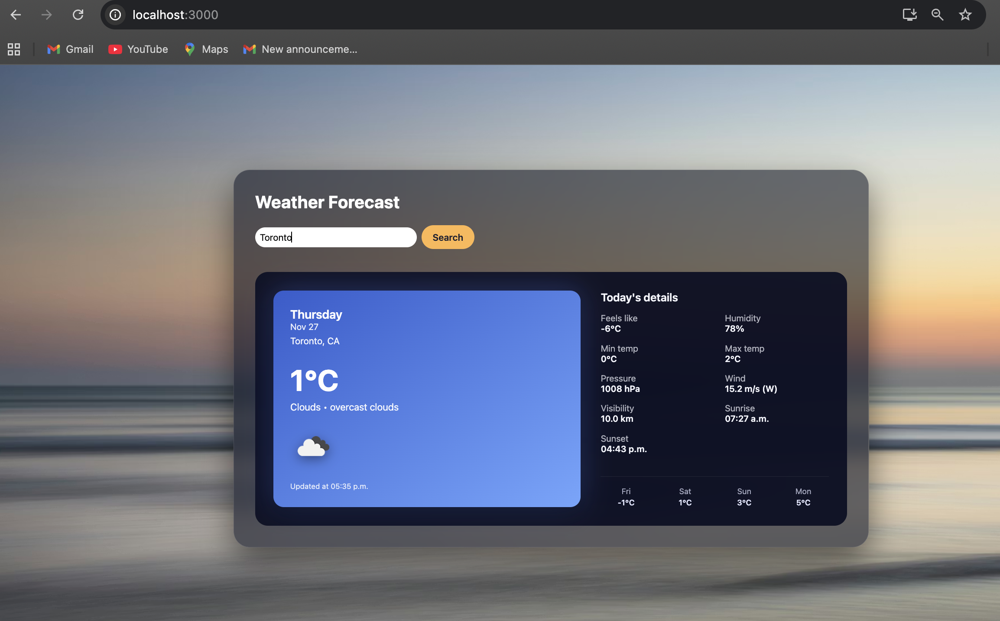
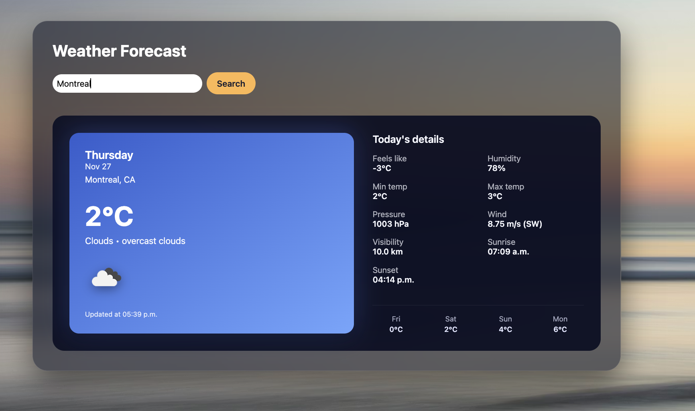
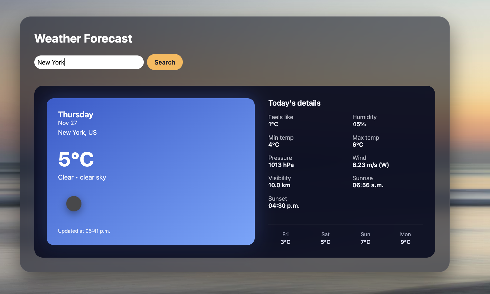
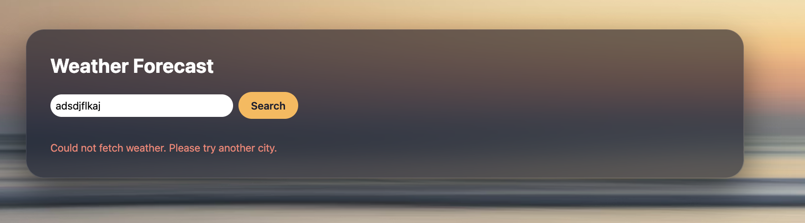
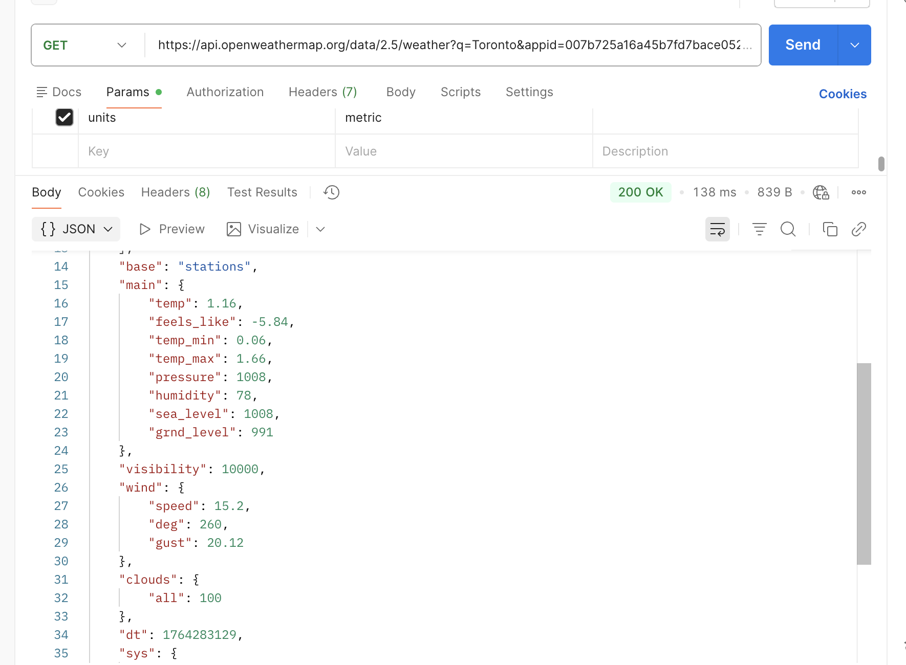

# 101532464_comp3123_labtest2 – Weather App

## Student Information
**Name:** Heemal Syangbo  
**Student ID:** 101532464  
**Course:** COMP 3123 – Full Stack Development I  
**Lab Test 2 – Weather App**

---

## Description
This React Weather App displays real-time weather data for any city using the **OpenWeatherMap Current Weather API**.  
Users can search for a city and view detailed weather information including:

- Temperature (°C)  
- Feels Like (°C)  
- Minimum & Maximum Temperature  
- Weather Condition (Clear, Clouds, Snow, etc.)  
- Weather Icon  
- Humidity  
- Pressure  
- Wind Speed & Direction  
- Visibility (km)  
- Sunrise / Sunset  
- Last Updated Time  
- 4-day mini forecast preview (mock forecast based on current weather)

The UI includes a **sunset sky background**, **glass-morphism card**, **gradient left temperature panel**, and a modern search bar for a polished experience.

---

## Features

### ✔ Functional Features
- Search any city’s weather  
- Toronto auto-loads on startup  
- Detailed weather metrics  
- Error state for invalid input  
- Loading indicator  
- Weather icons included  
- 4-day mini forecast (mock)

### ✔ UI/UX Features (Premium)
- Beautiful sunset sky background  
- Glass-morphism main card  
- Gradient temperature box  
- Large temperature UI  
- Clean search bar + button  
- Professional spacing & layout  
- Fully responsive on mobile  

---

## Tech Stack
- **ReactJS (Create React App)**
- **Axios** for API requests
- **JavaScript (ES6)**
- **CSS (custom styling)**
- **OpenWeatherMap API**

---

## Screenshots

### 1. Default Toronto Weather  

### 2. Second City — Montreal  

### 3. Second City — New York  

### 4. Error State — Invalid City  

### 5. Postman API Response  

---

## API Used  
**OpenWeatherMap – Current Weather Data**  
Endpoint pattern:
https://api.openweathermap.org/data/2.5/weather?q=%7BCITY%7D&appid=%7BAPI_KEY%7D&units=metric

### Parameters:
- **q** → City name (e.g., Toronto)  
- **appid** → Your OpenWeatherMap API key  
- **units=metric** → Celsius  

### Example Request:
https://api.openweathermap.org/data/2.5/weather?q=Toronto&appid=YOUR_API_KEY&units=metric

### Weather API Response Includes:
- Coordinates  
- Weather condition + icon  
- Temperature (current/min/max)  
- Feels like  
- Pressure  
- Humidity  
- Visibility  
- Wind (speed + direction)  
- Sunrise / Sunset times  
- Timestamp  

---

